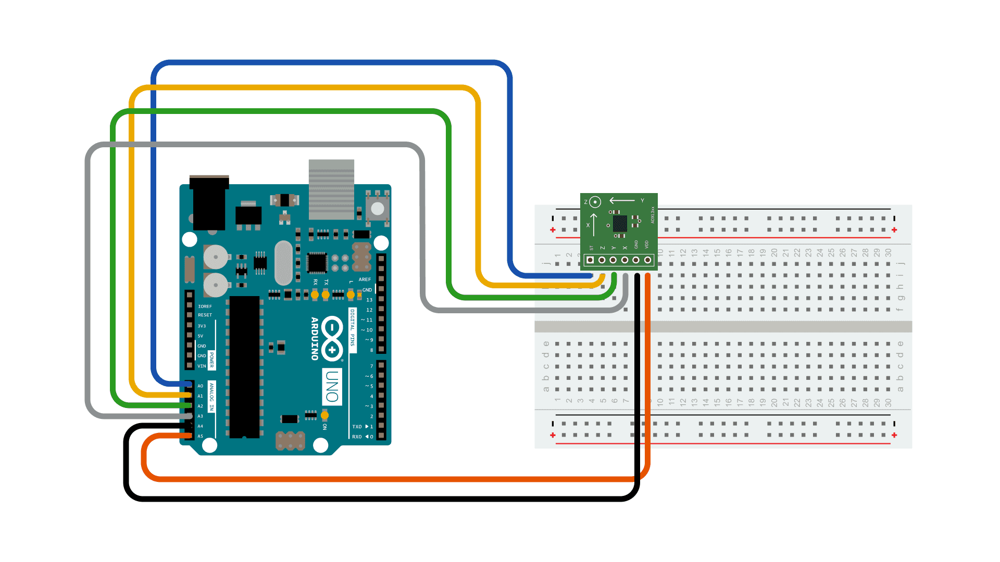

ADXL3xx выводит ускорение на каждой оси в виде аналогового напряжения от 0 до 5 вольт. Чтобы прочитать это, все, что вам нужно, - это функция analogRead().

Соединения акселерометра определены как постоянные в начале эскиза, используя два аналоговых вывода 4 и 5 в качестве источника питания. Это достигается с помощью их в качестве цифровых выводов ввода-вывода 18 и 19. При необходимости 0 равно D14, 1 равно D15 и так далее.

const int штифт заземления = 18; const int штифт питания = 19;

Установка вывода 19 (A 5) как ВЫСОКОГО, а вывода 18 (A 4) как НИЗКОГО обеспечивает 5 В с несколькими миллиамперами, необходимыми акселерометру для работы.

pinMode (вывод заземления, ВЫХОД); pinMode (вывод питания, ВЫХОД); digitalWrite (вывод заземления, НИЗКИЙ); digitalWrite (вывод питания, ВЫСОКИЙ);

Это решение позволяет подключать платы breakout от Sparkfun непосредственно к вашей плате Arduino. Различные платы могут быть подключены к стандартным выводам 5 В или 3,3 В и GND. В этом последнем случае код может быть изменен, комментируя строки выше в разделе void setup().