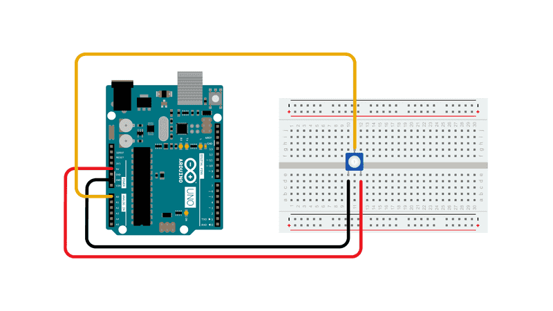

Подсоедините три провода от потенциометра к вашей плате. Первый идет от одного из внешних выводов потенциометра к земле. Второй идет от другого внешнего вывода потенциометра до 5 вольт. Третий идет от среднего вывода потенциометра к аналоговому выводу A0.

Поворачивая вал потенциометра, вы изменяете величину сопротивления с обеих сторон стеклоочистителя, который соединен с центральным выводом потенциометра. Это изменяет напряжение на центральном выводе. Когда сопротивление между центром и стороной, подключенной к 5 вольтам, близко к нулю (а сопротивление на другой стороне близко к 10 ком), напряжение на центральном выводе приближается к 5 вольтам. Когда сопротивления меняются местами, напряжение на центральном выводе приближается к 0 вольтам или заземлению. Это напряжение является аналоговым напряжением, которое вы считываете в качестве входного сигнала.

Подсоедините три провода от потенциометра к вашей плате. Первый идет от одного из внешних выводов потенциометра к земле. Второй идет от другого внешнего вывода потенциометра до 5 вольт. Третий идет от среднего вывода потенциометра к аналоговому выводу A0.

Поворачивая вал потенциометра, вы изменяете величину сопротивления с обеих сторон стеклоочистителя, который соединен с центральным выводом потенциометра. Это изменяет напряжение на центральном выводе. Когда сопротивление между центром и стороной, подключенной к 5 вольтам, близко к нулю (а сопротивление на другой стороне близко к 10 ком), напряжение на центральном выводе приближается к 5 вольтам. Когда сопротивления меняются местами, напряжение на центральном выводе приближается к 0 вольтам или заземлению. Это напряжение является аналоговым напряжением, которое вы считываете в качестве входного сигнала.

Платы Arduino имеют внутри схему, называемую аналого-цифровым преобразователем или АЦП, которая считывает это изменяющееся напряжение и преобразует его в число от 0 до 1023. Когда вал полностью повернут в одном направлении, на вывод подается 0 вольт, а входное значение равно 0. Когда вал поворачивается до упора в противоположном направлении, на вывод подается 5 вольт, а входное значение равно 1023. Между ними функция analogRead() возвращает число от 0 до 1023, пропорциональное величине напряжения, подаваемого на вывод.
