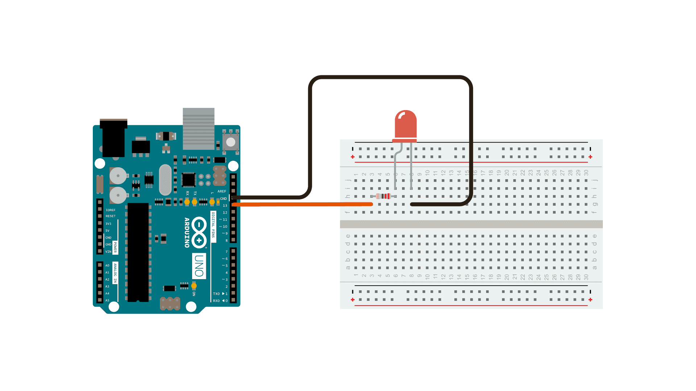

Иногда вам нужно делать две вещи одновременно. Например, вы можете захотеть мигать светодиодом во время считывания нажатия кнопки. В этом случае вы не можете использовать delay(), потому что Arduino приостанавливает вашу программу во время задержки(). Если кнопка нажата во время приостановки Arduino в ожидании истечения задержки (), ваша программа пропустит нажатие кнопки.

Этот эскиз демонстрирует, как мигать светодиодом без использования задержки(). Он включает светодиод, а затем отмечает время. Затем, каждый раз через цикл(), он проверяет, прошло ли желаемое время мигания. Если это так, он включает или выключает светодиод и отмечает новое время. Таким образом, светодиод непрерывно мигает, в то время как выполнение эскиза никогда не задерживается ни на одной инструкции.

Аналогией было бы разогревать пиццу в микроволновке, а также ждать важного электронного письма. Вы кладете пиццу в микроволновую печь и ставите ее на 10 минут. Аналогией с использованием функции delay() было бы сидеть перед микроволновой печью и наблюдать, как таймер отсчитывает время с 10 минут до тех пор, пока таймер не достигнет нуля. Если важное электронное письмо придет в течение этого времени, вы его пропустите.

Что бы вы сделали в реальной жизни, так это включили пиццу, а затем проверили свою электронную почту, а затем, возможно, сделали что-то еще (это не займет слишком много времени!), И время от времени вы будете возвращаться к микроволновой печи, чтобы посмотреть, достиг ли таймер нуля, указывая, что ваша пицца готова.

Чтобы построить схему, подсоедините один конец резистора к контакту 13 платы. Подсоедините длинную ветвь светодиода (положительную ветвь, называемую анодом) к другому концу резистора. Подключите короткую ветвь светодиода (отрицательную ветвь, называемую катодом) к плате GND, как показано на схеме выше и схеме ниже.

На большинстве плат Arduino уже есть светодиод, подключенный к контакту 13 на самой плате. Если вы запустите этот пример без подключенного оборудования, вы увидите, что индикатор мигает.