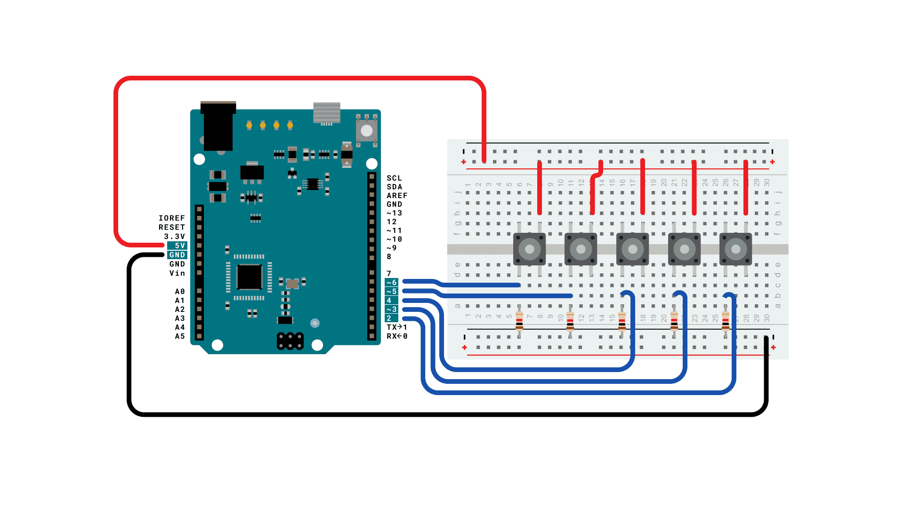

Используя библиотеку мыши, вы можете управлять экранным курсором компьютера с помощью Arduino Leonardo, Micro или Due. Четыре кнопки являются направленными (вверх, вниз, влево, вправо), а одна предназначена для щелчка левой кнопкой мыши

Перемещение курсора с Arduino всегда относительно. Каждый раз, когда считывается ввод, положение курсора обновляется относительно его текущего положения.

Всякий раз, когда нажимается одна из кнопок направления, Arduino перемещает мышь, отображая ВЫСОКИЙ входной сигнал в диапазоне 5 в соответствующем направлении.

Пятая кнопка предназначена для управления щелчком левой кнопкой мыши. При нажатии плата отправляет нажатие на компьютер. Когда кнопка будет отпущена, компьютер распознает событие.

ПРИМЕЧАНИЕ: Когда вы используете команду Mouse.move(), Arduino управляет курсором вашего компьютера! Чтобы не потерять контроль над компьютером во время выполнения эскиза с помощью этой функции, обязательно настройте контроллер перед вызовом функции Mouse.move(). Этот эскиз обновляет положение курсора только при нажатии кнопки.

Подключите плату к компьютеру с помощью кабеля micro-USB. Кнопки подключены к цифровым входам от 2 до 6. Убедитесь, что вы используете выдвижные резисторы 10 Ком.