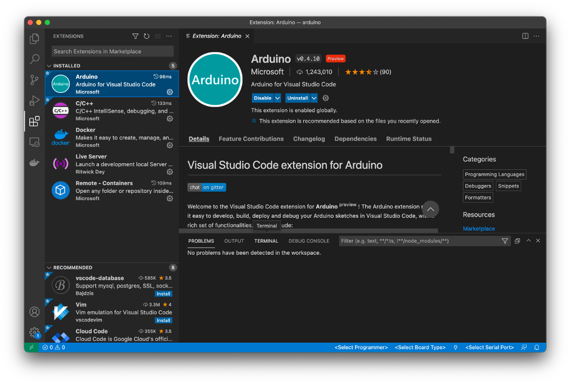

#### ПО
1. Эмульяторы
	- MacOS - [Ссылка](https://xevro.be/products/arduino-simulator-macos-free.html)
	- Windows – [Ссылка](https://xevro.be/products/arduino-simulator-windows-free.html )
2. IDE
	- VS Code - [Ссылка](https://code.visualstudio.com/)
	- Расширение – 
    
#### Список методов
- [Ссылка](https://www.arduino.cc/reference/en/?_gl=1*hdsn8e*_ga*NDczOTcwNzk3LjE2NDI4NTEyMzk.*_ga_NEXN8H46L5*MTY0MzQ0Njk5NS41LjEuMTY0MzQ0NzE0OS4w)
        